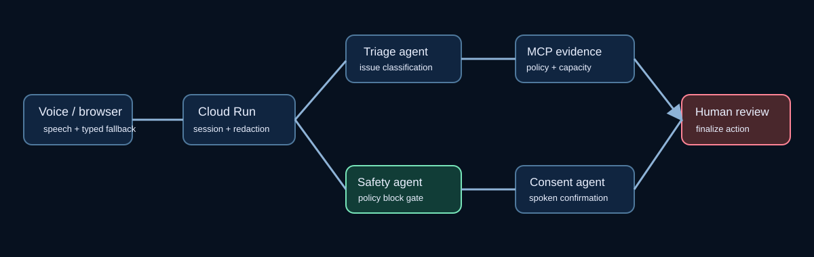

# SunoSentry (सुनो Sentry)

**A verifiable multi-agent voice-operations platform for field-service dispatch.**

**Live demo:** https://sunosentry-benchmark-122722888597.us-central1.run.app

Most voice-agent demos optimize for a natural conversation. SunoSentry is built
for the operational moment after the conversation: whether a proposed service
action is safe, grounded in policy, explicitly confirmed, and simple for a
human dispatcher to audit.



## Why this is a stronger voice-AI project

Field service, property operations, utilities, and customer-support teams all
receive high-intent voice requests. The implementation focuses on the hard,
portable production concerns rather than a single scripted appointment flow:

- **Voice-first web experience:** browser microphone recognition and speech
  synthesis, with typed fallback for a reproducible demo.
- **Bounded multi-agent supervisor:** triage, policy-grounding, planning,
  consent, and safety specialists emit a visible per-call trace.
- **Verifiable action:** a recommendation can only move to a human-review
  queue after explicit confirmation. The app never silently books, bills, or
  dispatches.
- **Real safety control:** suspected gas/fume incidents block automation and
  immediately produce a human-escalation packet.
- **Real MCP client boundary:** the supervisor uses a stateless MCP stdio
  client with a closed-world tool registry. Unknown tools and malformed
  arguments are denied by default; the two read-only tools carry MCP risk
  annotations and return HMAC-signed policy evidence with a trace ID and task
  handle.
- **Fail-closed triage:** deterministic rules run first, then the smallest
  Flash-Lite classifier only for ambiguity, and a larger model only when the
  lite result abstains. The structured schema has an explicit `abstain` value.
- **VoiceOps observability:** latency, step completeness, PII redactions,
  safety blocks, verified handoffs, and full decision traces are visible.
- **Vertex AI, safely bounded:** Gemini can polish an already-approved spoken
  acknowledgement; it cannot classify risk, select policy, invoke an MCP write,
  or bypass the consent gate.
- **Real cloud control plane:** redacted session state is durably stored in
  Firestore and human-review handoffs publish redacted metadata to Pub/Sub.

The live integration evidence, including the explicit Vertex fallback boundary,
is recorded in [docs/live_gcp_evidence.md](docs/live_gcp_evidence.md).

This is a simulated operational environment. It is not medical advice,
emergency response, telephony, technician dispatch, or a customer deployment.

## Measured control benchmark

The repository includes a reproducible **2,048-case adversarial evaluation**
covering prompt injection, ambiguous consent, policy conflicts, MCP/tool
failures, PII redaction, and distribution shift. The deterministic run records
100% safety and classifier-control pass rates for the rules-first multi-agent
design; the deliberately naive single-agent ablation records 62.5% on the same
suite. It also reports p50/p95 latency, MCP calls, PII redactions, and an
explicitly labelled cost proxy. These are controlled synthetic results, not
customer outcomes or GCP invoice totals. Run `PYTHONPATH=src python
evals/voiceops_benchmark.py` to reproduce them.

## Architecture

```text
Browser microphone / text
          │
          ▼
 Cloud Run FastAPI ──► rules router ──► bounded classifier (abstain)
          │                                      │
          │                         real MCP client boundary
          │                    signed policy + capacity evidence
          ▼                                      ▼
        planning-agent ──► consent-agent ──► human-review handoff
          │                    │
          └──── safety-agent blocks high-risk automation

Trace events → VoiceOps dashboard / future Cloud Trace & BigQuery sink
```

## GCP deployment

The container is designed for Cloud Run. The demo uses no committed secret and
does not need a telephony key. It can be deployed with:

```bash
gcloud run deploy sunosentry --source . --region us-east4 --allow-unauthenticated
```

The current public demo is deployed in `us-east4` with Cloud Run autoscaling to
zero. The active revision was independently checked for health and for the
gas/fume safety block before publication.

See [deployment guidance](docs/deployment.md) for the production path:
Vertex AI, Secret Manager, Cloud Trace, Pub/Sub, BigQuery, and a telephony
adapter with explicit consent and retention controls.

## Run locally

```bash
python3 -m venv .venv
. .venv/bin/activate
pip install -e '.[dev]'
uvicorn sunosentry.api:app --reload --port 8080
```

Then open `http://localhost:8080` and try the three scenario buttons.

## Tests and evaluation

```bash
python3 -m pytest -q
python3 -m sunosentry.mcp_server
```

The unit suite verifies the two non-negotiable properties: emergency safety
blocks do not create a dispatch, and non-emergency proposals require spoken
confirmation before a human-review handoff.

## Resume-safe framing

> Built SunoSentry, a Cloud Run-deployed voice-operations control plane for
> field-service intake; persisted redacted call state in Firestore, published
> human-review events to Pub/Sub, and validated 36 scripted safety/consent
> scenarios with 12/12 emergency blocks and 24/24 consent-gate checks. Capacity
> and final dispatch remain simulated and human-reviewed.
